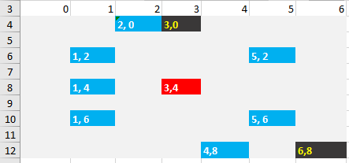
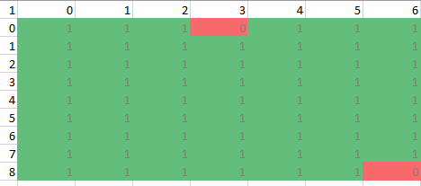
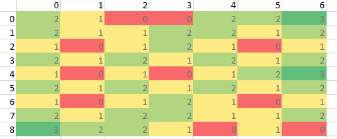

# 基于多目标优化的小区COVID-19核酸采样点选址模型
Alex Dou, FRM

.

 
 

### 1. 问题的提出
居民小区进行COVID-19全员核酸采样时，如果采样点的选址不合理或者采样组织不善，则有可能造成人员聚集，从而增加交叉感染的风险。另外，有些居民小区的老年人较多，在选址上还需要考虑居民的便捷。而在实际基层管理中，居民小区采样点的选址往往具有一定的主观性和随意性。有必要采用空间数据分析及优化的方法，来更科学更合理地对采样点进行选址。

 

### 2. 居民小区核酸采样点选址优化的基本思路
小区内核酸采样点的选址需要兼顾不同目标，比如既要方便尽可能多的居民，也要给间隔2米排队留足距离。另外，如果小区内有被封闭管理的阳性居民楼，则采样点还最好能远离这些有阳性病例的居民楼。对于这类多目标优化问题，我们需要先厘清优化目标及约束条件。

#### 优化目标

* (1) 采样点应该离居民楼尽可能近，以方便多数居民；
* (2) 采样点应离阳性居民楼较远，以减少感染风险。

#### 约束条件
* (1) 采样点必须在居民小区内。
* (2) 采样点离任何一栋居民楼的距离应大于一个阈值，即最小安全距离，以使得每一栋楼的居民都有足够的排队距离，避免拥挤聚集；
* (3) 采样点应避开不适合作为采样点的障碍物区域，比如，小区内的景观水池、垃圾房等等。

 

### 3. 数学模型
对于上面讨论的核酸采样点选址优化的基本思路，需要将其转为对应数学模型来进行优化计算。

#### Distance Function
距离计算是空间数据分析的基础之一。平面上两点之间的直线距离可以用欧几里得距离来表示。但是城市和居民小区中，由于道路规划和建筑物阻隔，欧几里得距离并不适用。根据加特雷尔(Gatrell, 1983)基于法国城市的数据分析，欧几里得距离通常比实际路线距离更短。在居民小区的核酸采样点选址建模中，采用**曼哈顿距离(Manhattan distance)** 来计算采样点和居民楼之间的距离。

设a, b为2D空间的点，则其 **曼哈顿距离(Manhattan distance)** 为

$
D_{a,b} = {{|x_a-x_b|\ +\ |y_a-y_b|}}
\space\space\space\space\space\space\space\space (3.1)
$

设s为核酸采样点，小区内共有**N (N>0)** 栋居民楼，其中**M(0<M<=N)** 栋为有阳性病例的居民楼。则**s**与第**i**栋居民楼的曼哈顿距离为

$
D_{s,i} = {{|x_s-x_i|\ +\ |y_s-y_i|}}
\space\space\space\space\space\space\space\space (3.2)
$

 

#### Objective Function
小区内核酸采样点的选址优化目标要兼顾便捷与安全，即既要离多数居民楼尽量近，也要离阳性病例居民楼保持一定距离。用下列公式来表示包含了这两个目标项的目标函数。

$
min \space \space \sum_{i=0}^{N}{D_{s, i}} - W_{safe}\sum_{j=0}^{M}{D_{s, j}}
\space\space\space\space\space\space\space\space (3.3)
$

$
其中W_{safe}为安全权重，该值越大，选址越远离阳性病例居民楼；该值越小，越忽略阳性病例居民楼的影响。
$
 
#### Constrains
在全小区进行核酸采样时，为了减少人员聚集带来的的交叉感染风险，排队需要保持2米间隔。因此核酸采样点和居民楼之间应有足够的距离，以确保留出足够长的排队空间。所以，主要的约束条件是：**(1)** 采样点与任何一栋居民楼的距离均应大于一个安全距离阈值; **(2)** 不能设置在障碍区域。

设s为核酸采样点，小区内共有 **N (N>0)** 栋居民楼，小区内还有**L**处障碍，则约束条件用如下数学公式表示。

$
  s.t. \space \space 0 \leq x_s \leq x_{max}
  \space\space\space\space\space\space\space\space (3.4)
$
$
  s.t. \space \space 0 \leq y_s \leq y_{max}
  \space\space\space\space\space\space\space\space (3.5)
$

$
  s.t. \space \space i \in 	\mathbb{N}, 0 \leq j \leq N, min(D_{s, i}) > D_{safe}
  \space\space\space\space\space\space\space\space (3.6)
$
$
  s.t. \space \space j \in \mathbb{N}, 0 \leq j \leq L, min(D_{s, o_j}) > 0
  \space\space\space\space\space\space\space\space (3.7)
$

$
 其中， x_s, y_s表示采样点s的坐标，o_j表示第j处障碍区域
$

 

### 4. 参考实现
本模型的参考实现基于Excel电子表格。Excel不仅具有交互、计算和可视化功能，其单元格网格也可以被用来表示大致的地理坐标。另外，通过Excel来实现空间的可视化，可以让整个选址算法更可解释、可理解，而不是仅仅给出优化后的坐标数值。参考实现的下载地址为: https://github.com/autoasm/covid-19

#### 住宅小区地图
用Excel中的单元格矩阵来表示小区地图，每个单元格的坐标由其行列号表示。如下图所示。蓝色单元格表示无阳性病例居民楼 ，红色单元格表示有阳性病例居民楼，黑色单元格表示障碍区域，对应的数值为该楼栋在小区地图坐标系中的坐标。

#### Constrains
用Excel中的单元格矩阵来计算和表示不同区域对最小安全距离约束条件的满足情况。用Excel模拟运算表来计算，离居民楼最近距离约束的运算公式在**I15**单元格中。该单元格计算公式是公式 **(3.6)** 的实现。避开障碍区域约束的运算公式在**I27**单元格中，该单元格实现 **(3.7)** 所描述的约束。

#### Objective Function
用Excel中的单元格矩阵来计算和表示小区地图上不同区域对应的目标函数值。用Excel模拟运算表来计算，运算公式为在**I3**单元格中。该单元格计算公式是公式 **(3.3)** 的实现。

#### 参数调整与结果解读
需要调节的参数为**Safe Distance Weight**，可以通过控件来对该值进行调节。值越大，则选址越倾向于远离阳性病例居民楼，即安全优先；值越小，则阳性病例居民楼的影响越小，即便捷优先。

在**最小距离约束条件矩阵**中，单元格的数值为采样点到居民楼的最小距离，按照 **(3.6)** 所示的约束条件，低于一定距离的区域应该被排除。具体阈值由用户自行决定。

如上图，如果最小安全距离为2，则所有小于2的区域均不能用于设置采样点。而(6,0)和(0,8)位置具有最大的安全距离。

**障碍物区域约束条件矩阵**
该矩阵表示了地图上每个区域对于障碍物约束，即式 **(3.7)** 的满足情况。元素值为1说明该元素对应的区域满足障碍区域约束；而单元格中的数值为0，则说明该区域为障碍区域，不能作为采样点使用。

**可用区域矩阵**
将最小距离约束条件矩阵与障碍物区域约束条件矩阵中的对应元素相乘，即同时考虑上述两个约束条件，则可得到可用区域矩阵。该矩阵中为0的元素所表示的区域为不可用区域，其他>0的元素所对应的区域可用性视最小安全距离而定，不小于最小安全距离的元素所对应的区域为可用候选区域。

在**优化目标矩阵**中，单元格数值为优化函数值，按照 **(3.3)** 所示的优化目标，该值越小说明该点越合适。

如上图所示，由于地图中小区中间位置居民楼为阳性病例居民楼，因此对于给定的参数，模型认为该处不适合用于设置采样点。

通过可视化的**可用区域矩阵**和**优化目标矩阵**即可了解选址的计算过程及结果。

 

### 5. 总结
小区内核酸采样点的选址合理与否会影响采样时交叉感染的风险。本文所述的基于多目标优化的选址模型可以对小区内采样点的选址进行优化。在确保和居民楼之间的安全距离的前提下，为多数居民提供便捷且和阳性病例居民楼保持距离，在安全和方便之间取得平衡。同时，本模型还考虑了居民小区内一些可能的障碍物如景观水池等因素对于采样点选址的影响，选址模型会避开这些在地图上指定的障碍区域。在目前的基于Excel实现中，可以通过自行修改坐标及计算表达式来进行定制地图和优化策略。

 

#### 致谢
Aleck对目标函数的改进提出过建议。

 

### References
* 刘浩洋 等. 最优化: 建模、算法与理论.[M].北京:高等教育出版社,2020
* [爱尔兰]斯图尔特 等.计量地理学[M].北京:商务印书馆出版社,2021
* 刘兰娟. 财经管理中的计算机应用[M].上海:上海财经大学出版社,2020
* [Manhattan distance [Explained][OL].https://iq.opengenus.org/manhattan-distance/](https://iq.opengenus.org/manhattan-distance/)
* [美]Ian Millington. 游戏中的人工智能(第3版)[M].北京:清华大学出版社,2021
